# Adopte un candidat functional specification 

  

## Table of Contents

1. [Introduction](#1-introduction)
   1. [Purpose](#11-purpose)
   2. [Goals](#12-goals)
   3. [Stakeholders](#12-stakeholders)
   4. [Project Scope](#12-project-scope)
	    1. [In Scope](#141-in-scope)
	    2. [Out of Scope](#142-out-of-scope)
   5. [Risks and Assumptions](#14-risks-and-assumptions)
   6. [Deliverables and Milestones](#15-deliverables-and-milestones)
2. [Solution Overview](#2-solution-overview)
   1. [Product Overview](#21-product-overview)
3. [Functional Specification](#3-functional-specification)
   1. [Personas](#31-personas)
   2. [Use cases](#31-use-cases)
   3. [Mock-up](#32-mock-up)
   4. [Functional Requirements](#33-functional-requirements)
   5. [Non-Functional Requirements](#34-non-functional-requirements)
4. [System Configuration](#5-system-configuration)
   
5. [Integration Requirements](#6-integration-requirements)
   1. [Error Reporting](#61-error-reporting)
6. [Glossary](#7-glossary)

## 1. Introduction

### 1.1 Purpose
Adopte 1 candidat is an application that allows companies to recruit candidates for their job offers requested by the client We are evolution. The application is based on the principle of the dating application Tinder. The company can create a job offer and the candidates can apply for the job offer. The company can then accept or refuse the candidate. The candidate has anonymous profile and can also accept or refuse the job offer. If both the company and the candidate accept each other, they can chat together. The application is available on Android and Windows.

### 1.2 Goals

-  2 type of users: company and candidate
- Candidates have an anonymous profile
- Each user can Like, Pass or Cancel other users
- If their have match, they can chat together, company alway send the first message 

- Available on Android and Windows
- Set area of job offer
- Candidates share their hard skills and soft skills.
- Companies share their job offer, salary, schedule and perks 

### 1.3 Stakeholders

#### 1.3.1 Project Team Members
| Name | Role | Link |
|------|------|------|
| Rémy Charle     | Project Manager     |  [GitHub](https://github.com/RemyCHARLES)    |
|   Salaheddine Namir   | Program Manager     |  [GitHub](https://github.com/T3rryc)    |
|    Lucas Megnan  | Technical Lead          |  [GitHub](https://github.com/LucasMegnan)    |
|  Michel Riff    | Software Enginner          |   [GitHub](https://github.com/MichelRiff)   |
|  Max Bernard    | Quality Assurance         |   [GitHub](https://github.com/maxbernard3)   |

#### 1.3.2 Other Stakeholders
| Name | Role | Link |
|------|------|------|
|   ALGOSUP    | School     |  [Website](https://www.algosup.com/)    |
|We are evolution| Client	 |  [Website](https://www.we-are-evolution.com/)    |

### 1.4 Project Scope

#### 1.4.1 In Scope

- Use flutter to create the application
- Front End
- Search by location
- Chat
- Like, pass and cancel button
- Cancel profile in a case of unexpected like
- Anonymization of candidates profile
- Create account

#### 1.4.2 Out of Scope
- Back End
- Admin panel
- Monetization

### 1.5 Risks and Assumptions

| Risk| Impact| Mitigation|
|------|------|------|
|Team don't understand the requirements |High|PRD was already send to the client and it was been validated|
|Poorly structured source code|High|The team have decided to use the convention of the [official dart website](https://dart.dev/effective-dart/style) to write and structured the source code |
| The team is not familiar with the technology used | High | The team have decided to use the [flutter documentation](https://flutter.dev/docs) to learn the technology |
|The prodcut isn't deliver at time|High|Each part of the project has deadline|
|OS compatibility|Medium| Flutter is design to build cross-platform application|
|Communication between team members|High|Team has private slack server to communicate, share information even remotly|

### 1.6 Deliverables and Milestones
|Date And Time | Deliverable |
|-------------|-------------|
|      05/24/2024 5PM       |    Functional Specification         |
|	  06/07/2024 5PM       |    Technical Specification             |
|	  06/07/2024 5PM       |    Test Plan             |
|	  06/14/2024 5PM       |    Code            |
|	  06/14/2024 5PM       |    User Manual            |
|	  06/21/2024 9AM       |    Oral Presentation            |

## 2. Solution Overview

### 2.1 Product Overview

## 3. Functional Specification

### 3.1 Personas

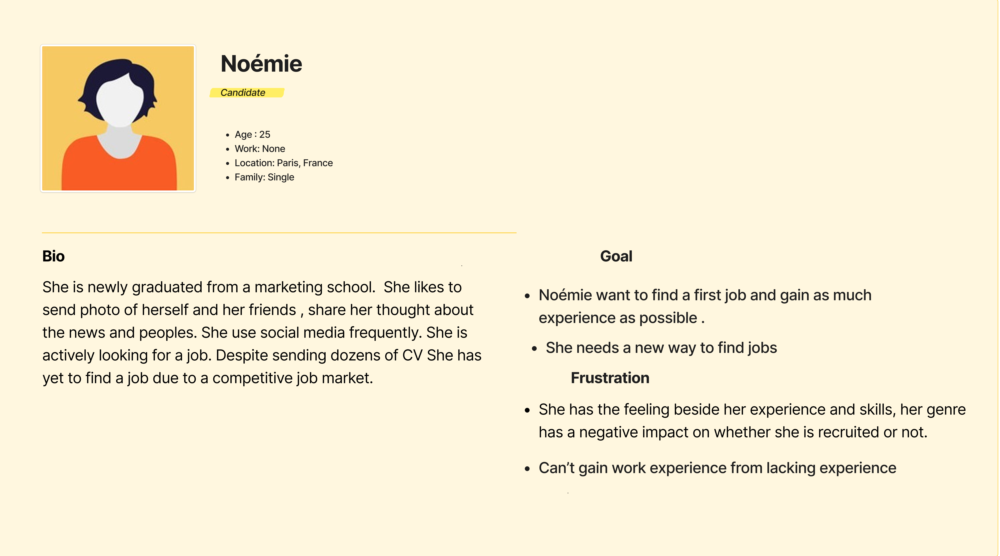

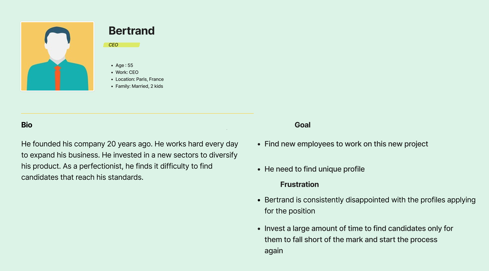

### 3.2 Use cases

|Name|Description|Actors|Basic flow|Alternative flow|Exception flow|Post condition|
|----|-----------|------|----------|----------------|--------------|--------------|
|Create account|The user create an account|Candidate, Company|The user click on the create account button, fill the form and click on the submit button|The user click on the cancel button|The user click on the submit button without fill the form|The user is redirect to the home page|
|Login|The user login|Candidate, Company|The user click on the login button, fill the form and click on the submit button|The user click on the cancel button|The user click on the submit button without fill the form|The user is redirect to the home page|
|Like|The user like another user|Candidate, Company|The user click on the like button|The user click on the pass button|The user click on the cancel button|The user is redirect to the home page|
|Pass|The user pass another user|Candidate, Company|The user click on the pass button|The user click on the like button|The user click on the cancel button|The user is redirect to the home page|
|Cancel|The user cancel another user|Candidate, Company|The user click on the cancel button|The user click on the like button|The user click on the pass button|The user is redirect to the home page|
|Chat|The user chat with another user|Candidate, Company|The user click on the chat button|The user click on the cancel button|The user click on the like button|The user is redirect to the chat page|
|Search|The user search another user|Candidate, Company|The user click on the search button, fill the form and click on the submit button|The user click on the cancel button|The user click on the submit button without fill the form|The user is redirect to the search page|
|Logout|The user logout|Candidate, Company|The user click on the logout button|The user click on the cancel button|The user click on the submit button without fill the form|The user is redirect to the home page|
|Setting||Candidate, Company||||||
|Filter||Candidate, Company||||||
| Edit profile||Candidate, Company||||||
|Set location||Candidate, Company||||||
|Match history||Candidate, Company||||||

### 3.3 Mock-up

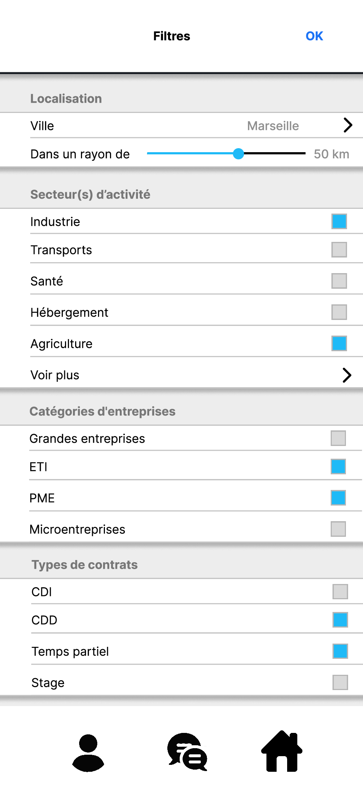
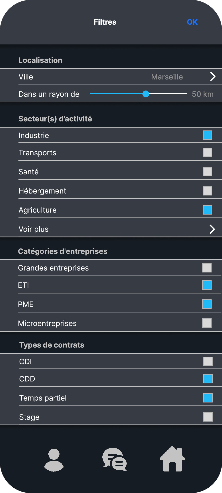
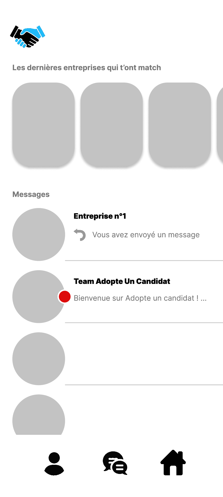
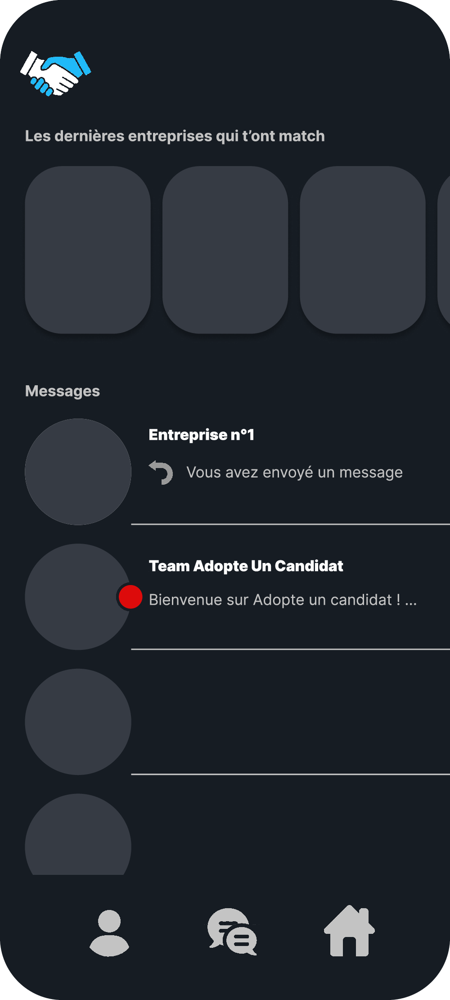
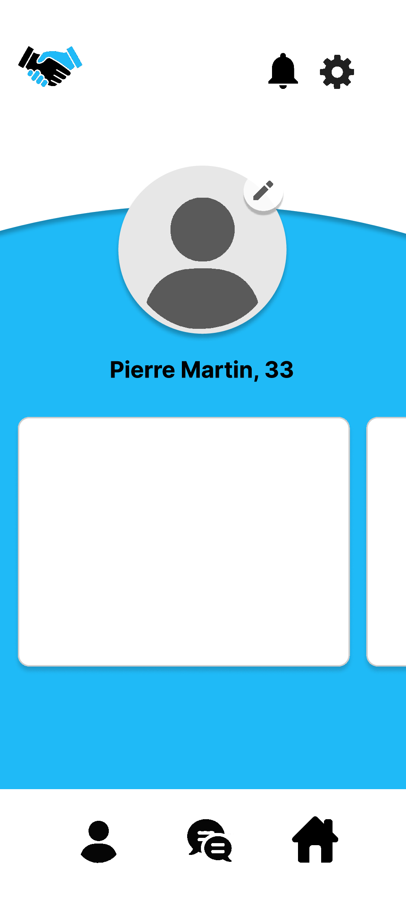
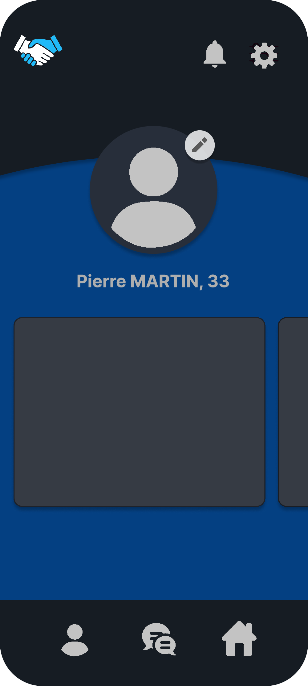
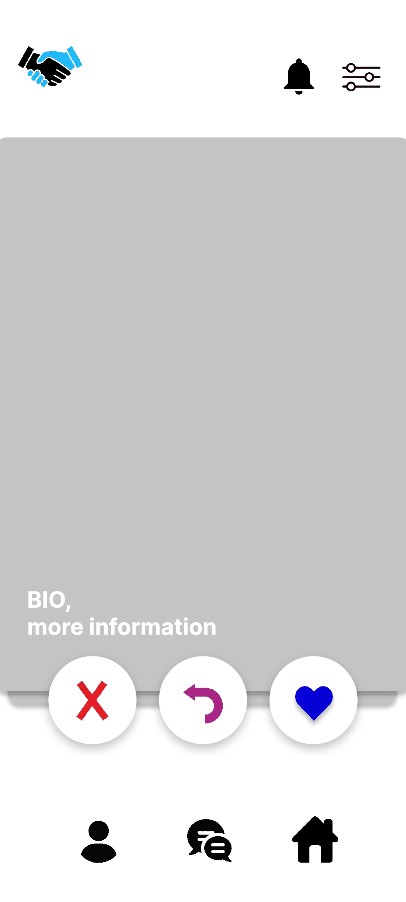
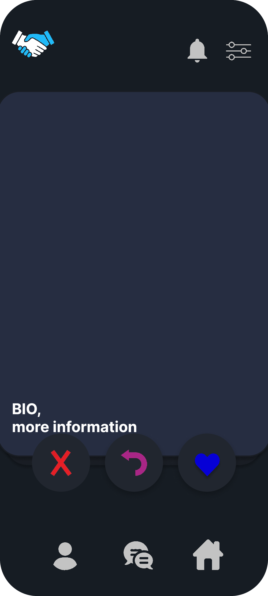

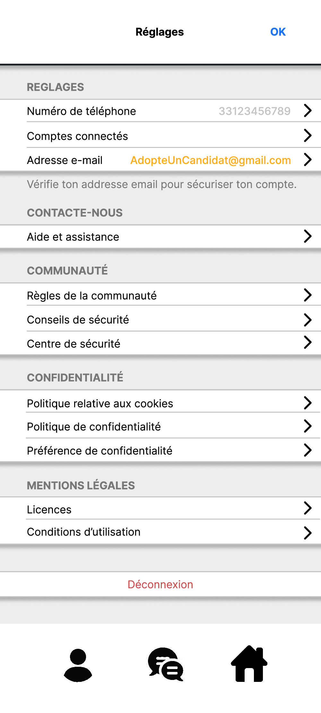
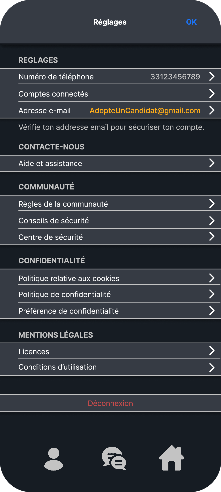

### 3.4 Functional Requirements

### 3.5 Non-Functional Requirements

- The application has French and English language
- The application has light and dark mode
- The application is adapted to all screen sizes

## 4. System Configuration

## 5. Integration Requirements

### 5.1 Error Reporting

## 6. Glossary

