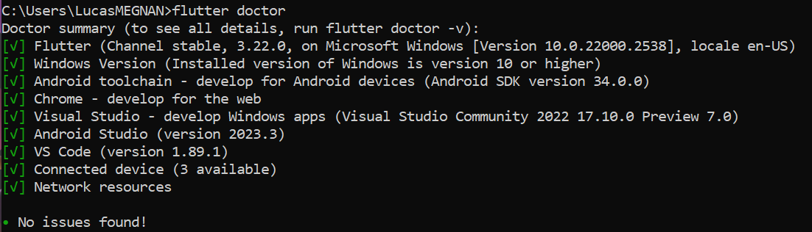
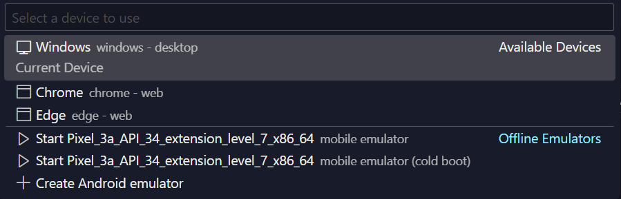

# Adopte Un Candidat Technical Specification

## Table of Contents

- [Adopte Un Candidat Technical Specification](#adopte-un-candidat-technical-specification)
  - [Table of Contents](#table-of-contents)
- [Technical](#technical)
- [Audience](#audience)
- [Deliverable](#deliverable)
  - [Details](#details)
  - [Requirements](#requirements)
  - [Nice to have](#nice-to-have)
  - [Priorities](#priorities)
- [Conventions](#conventions)
  - [Files \& Folders](#files--folders)
    - [*Naming*](#naming)
    - [*Organization*](#organization)
  - [GitHub](#github)
    - [*Naming*](#naming-1)
    - [*Organization*](#organization-1)
  - [Coding](#coding)
    - [*Naming*](#naming-2)
    - [*Comments*](#comments)
    - [*Formatting*](#formatting)
- [Technical Architecture](#technical-architecture)
  - [Technology Used](#technology-used)
    - [Tested Platforms](#tested-platforms)
    - [Software](#software)
    - [Real Device Used](#real-device-used)
      - [For Android :](#for-android-)
      - [For IOS :](#for-ios-)
      - [For PC :](#for-pc-)
- [Front-End](#front-end)
  - [Pages](#pages)
    - [**Login, Sign up**](#login-sign-up)
    - [**Profile**](#profile)
    - [**Main**](#main)
    - [**Direct Message (DM) list**](#direct-message-dm-list)
    - [**Direct message**](#direct-message)
    - [**Filter**](#filter)
- [Glossary](#glossary)

# Technical

# Audience

**This document is intended for :**

- **Software developer** : project's requirements, objectives, and constraints. It serves as a roadmap that guides the team in building the product, ensuring everyone is on the same page and working towards a common goal.
- **Program manager** : to validate against the functional specification and the client's expectations.
- **Quality assurance** : to assist in preparing the Test Plan and to use it for validating issues.
- **Project manager** : to help identify risks and dependencies.

# Deliverable

The team is tasked with making the front end of a recruitment application to facilitate the recruitment between companies and job-seekers.

## Details

The name of the application is "Adopte Un Candidat", is a "Tinder style" recruitment application that matches companies and job-seekers in a different way. The app will need to be available on phone, tablet and computer.

## Requirements

- Has to be programmed in Flutter.
- Anonymization of candidates.
- Valuing soft skills.
- Priority given to the human aspect.
- Matching between candidates and companies.

## Nice to have

- Release on the play store.
- Add a functionality to put your Monkey TIE's score.
- Add responsive application for computer.
- Some back-end to store data.
- Have the application in French and English.

## Priorities

- Do the Front-end of the app.
- Compatibility between phone, tablet and computer.

# Conventions

## Files & Folders

### *Naming*

all folders and files should be named in *UpperCamelCase*.

### *Organization*

- Images should be in an ./*Image* subfolder from where they are called.
- Technical, Functional and Management documents should be in their folder in a ./*Documents* folder.
- The code should be in an ./*Src* folder from the root.
- Folders and Files of the folder ./*Src* need to be in *lowercase_with_underscores* to be sensitive with the language Dart.

## GitHub

### *Naming*

GitHub branches should be named in *lowerCamelCase*.

### *Organization*

- The working version of the project goes into the main branch.
- the main should be updated at least once a week.
- There can't be any direct push to the main.
- There will only be 3 branches, document, code and main.
- Only push code that works and with no errors inside the code

## Coding

When in doubt follow this document : [Coding style](https://dart.dev/effective-dart/style), as this document only highlights the most important parts.

### *Naming*

Use clear names that describe the purpose of the object. Avoid abbreviations. Everything should be done in English.

- All classes and Enum are in *UpperCamelCase*.
- All functions are in *lowerCamelCase*.
- Constant variables are in *lowerCamelCase*.

### *Comments*

You can follow this link to have more information about the documentation : [Documentation style](https://dart.dev/effective-dart/documentation).

- Comments should be sentences.
- Don't use block comments for documentation.
- If something it's not easily understandable define it.

### *Formatting*

- Format your code using dart format.
- Changing your code to make it more formatter-friendly.
  
   If your code has particularly long identifiers, deeply nested expressions, a mixture of different kinds of operators, etc. the formatted output may still be hard to read. When that happens, reorganize or simplify your code.

- Avoid lines longer than 80 characters.
- Use curly braces for all flow control statement.

# Technical Architecture

## Technology Used

### Tested Platforms

- Pixel 8 pro **version** : vanilla ice cream.
- Huawei ELE L29 **version** : EMUI 12.0.0.
- Iphone 13 **version** : IOS 17.5.1.

### Software

Here's the technology stack and our IDE:

- Visual Studio Code **version** : 1.89.1.
- Android Studio **Version** : 2023.3.
- Flutter **version** : 3.22.0.
- SDK Android **version** : 34.0.0.
- Dart **version** : 3.4.0.

You can see your current version of Dart and Flutter with the command "flutter doctor -v" in your terminal.

To download a specific version of Flutter or Dart you can use this website: [Flutter Version Management with FVM](https://blog.flutter.wtf/flutter-version-management/).

### Real Device Used

To run Flutter code you can use phones and PCs, on phone it is possible to do it on Android and IOS.There are however certain requirements to be met, I will show you how to do it on different devices, if you prefer you can emulate a phone whit android studio.

**Firstly you need to setup Flutter.**

- So to do that, run the command "flutter doctor" in your terminal.

If all goes well it should display "No issue found!".

If something goes wrong, it will show you what the problem is and how you can fix it.
If the problem persist you can follow this link for documentation: [install flutter documentation](https://flutter-ko.dev/get-started/install).

Now that everything is working, we need to put our phones in developer mode. 

#### For Android :

- **Step 1** : Go to *Settings*.
- **Step 2** : Scroll down to *Build number*.
- **Step 3** : Tap *Build number* seven times. After the first few taps, you should see the steps counting down until you unlock the developer options. You may also have to enter your PIN for verification.
- **Step 4** : Once developer options are activated, you will see a message that reads.
- **Step 5** : Go back to the *Settings* pane and head to *System*, where you will now find *Developer* options as an entry.
- **Step 6** : Tap it and toggle the switch on if it is not already, and from there, you can proceed to make adjustments to your phone.

For more information about that click here : [dev mode for Android](https://www.digitaltrends.com/mobile/how-to-get-developer-options-on-android/).

#### For IOS :

Read this quick article from Apple to switch your Iphone in developer mode : [dev mode for IOS](https://developer.apple.com/documentation/xcode/enabling-developer-mode-on-a-device)

---

Once the profile is approved, you can manually install and immediately open other applications from this developer.

**Your iOS or Android device will now be visible from your IDE, allowing you to run and debug your application by installing the built debug APK.**

While you can debug and test your code on a virtual device, it is often better to do so on a real portable device.

#### For PC :

To debug and run your flutter code on PC is more easier than on phones, your OS is already a device.

You can directly run and debug your code, you don't need to setup something else.

You can use virtual devices on your PC, whether it is IOS or Android-based. Some of these emulators are already integrated to Android-Studio which you downloaded previously with the "flutter doctor" command on your CMD.

# Front-End

Firstly, all the front-end of the product should follow the design of the mock-up, available [here](https://www.figma.com/design/8HiEyUrys3luBBCaAXs9Rb/Flutter-project-5?node-id=0%3A1&t=Xz6hPo1pe5oYciEz-1).
You can see 2 old versions and the version we have selected for the project.

## Pages

### **Login, Sign up**

**Description** : This page is dedicated to sign in, after, they are redirected to the home page if they already have an account, or start the creation of their profile if they don't have an account.

**The login page allows users to** :

- Login, Sign up.
- Recover a forgotten password.
- Recover a forgotten e-mail, name account.

**The login page contains the following elements** :

| Field/Element      | Description                         | Type           | Rights      | Behavior                                                       |
| ------------------ | ----------------------------------- | -------------- | ----------- | -------------------------------------------------------------- |
| Sign up            | Button to create account.           | Button         | Clickable   | Validate email and password, redirect user to their profile.   |
| Login              | Button to go to login page.         | Button         | Clickable   | Redirect user to login page.                                   |
| Email              | The user's email.                   | Text field     | Editable    |                                                                |
| Password           | The user's password.                | Text field     | Editable    |                                                                |
| Confirm password   | Confirmation of user's password.    | Text field     | Editable    |                                                                |
| Job seeker/company | Button to choose user type.         | Switch button  | Clickable   | Switch between job seeker and company user types.              |
| Forgotten Password | Button to change the password.      | Button         | Clickable   | Receive an email to change the password.                       |
| Forgotten Email    | Button to change the Email.         | Button         | Clickable   | Give your phone number to change your email.                   |

**Flow chart** :

### **Profile**

**Description** : This page is dedicated to watch your profile and see what is visible by job-seekers or companies, you can modify your profile if you need or have access to the settings of the app.

**The profile page allows users to** :

- Edit your Profile.
- Modify your soft skills.
- Watch your profile.
- Access app's settings.
- Access direct messages list page.
- Access notification.
- Access main page.

**The profile page contains the following elements** :

| Field/Element      | Description                         | Type           | Rights      | Behavior                                                       |
| ------------------ | ----------------------------------- | -------------- | ----------- | -------------------------------------------------------------- |
| Edit profile       | Button to edit your profile.        | Button         | Clickable   | Inside you can edit your soft skills, research, ect ...        |
| Settings           | Button to go to settings app.       | Button         | Clickable   | Redirect user to settings app.                                 |
| Watch your profile | See what is visible.                | The page       |             |                                                                |
| DM list page       | The list of direct message.         | Button         | Clickable   |                                                                |
| Notification       | Watch your notifications.           | Button         | Clickable   | Inside you can see your new matches, new messages, ect ...     |
| Main page          | The page to swipe.                  | Button         | Clickable   |                                                                |

**Flow chart** :

### **Main**

**Description** : This page is dedicated to swipe companies or job-seekers. You can like and dislike their and go back in your last proposition to change your choice if it was a mistake. You can filter your choices, to have proposition more precise in what you search. You can go to the profile page and DM list page.

**The main page allows users to** :

- Access filter.
- Access notification.
- Access direct messages list page.
- Access profile page.
- Like and dislike.
- Go back to the last profile proposed.

**The profile page contains the following elements** :

| Field/Element      | Description                         | Type           | Rights      | Behavior                                                                 |
| ------------------ | ----------------------------------- | -------------- | ----------- | ------------------------------------------------------------------------ |
| Filter             | Button to apply search filters.     | Button         | Clickable   | Opens a filter menu to refine search criteria.                           |
| Notification       | Button to view notifications.       | Button         | Clickable   | Opens a page displaying new matches, messages, etc.                      |
| DM list page       | Button to view the DM list.         | Button         | Clickable   | Redirects to the direct messages list page.                              |
| Like               | Button to like a profile.           | Button         | Clickable   | Indicates interest in the current profile and shows the next profile.    |
| Dislike            | Button to dislike a profile.        | Button         | Clickable   | Indicates disinterest in the current profile and shows the next profile. |
| Go back            | Button to back to the last profile. | Button         | Clickable   | Reverts the action on the last swiped profile.                           |
| Profile page       | Button to access your profile.      | Button         | Clickable   | Redirects to the user's profile page.                                    |

**Flow chart** :

### **Direct Message (DM) list**

**Description** : This page is dedicated to read your different messages with companies or job-seekers, you can click on someone to send a message, if you slide in the right two buttons appear, you can mute a conversation to don't receive notification about this one and archive the conversation. You can also see your latest match with companies or job-seekers.

**The DM list page allows users to** :

- Access main page.
- Access profile page.
- Access Direct Message.
- See your latest matches.

**The DM list page contains the following elements** :

| Field/Element      | Description                               | Type           | Rights      | Behavior                                                   |
| ------------------ | ----------------------------------------- | -------------- | ----------- | ---------------------------------------------------------- |
| Main page          | Button to access the main page.           | Button         | Clickable   | Redirects to the main page for swiping.                    |
| Profile page       | Button to access your profile.            | Button         | Clickable   | Redirects to the user's profile page.                      |
| Direct Message     | DM with companies or job-seekers.         | List           | Clickable   | Opens the selected conversation to read and send messages. |
| Mute               | Button to mute a conversation.            | Button         | Clickable   | Mutes notifications for the selected conversation.         |
| Archive            | Button to archive a conversation.         | Button         | Clickable   | Archives the selected conversation.                        |
| Latest matches     | Section showing the latest matches.       | Section        | View only   | Displays the most recent matches for quick access.         |

**Flow chart** :

### **Direct message**

**Description** : This page is dedicated to read your message and send them. You can back in the precedent page with a button in the top right of the screen.

**The DM page allows users to** :

- Button to back to the precedent page.
- Send messages.
- Read messages.

**The DM page contains the following elements** :

| Field/Element  | Description                            | Type   | Rights    | Behavior                                                 |
| -------------- | -------------------------------------- | ------ | --------- | -------------------------------------------------------- |
| Back button    | Button to return to the previous page. | Button | Clickable | Redirects back to the DM list page.                      |
| Message input  | Text input field to compose messages.  | Input  | Editable  | Allows user to type and send a new message.              |
| Send button    | Button to send the composed message.   | Button | Clickable | Sends the typed message to the selected conversation.    |
| Message list   | List of messages in the conversation.  | List   | View only | Displays all messages in the current conversation.       |

**Flow chart** :

### **Filter**

**Description** : In this page you can change your settings of what you search to see more profile with what you want and need. You have also a button to apply your new filter in the top right of the screen and back in the main page.

**The filter page allows users to** :

- 

# Glossary

- In software engineering, the terms **frontend** and **backend** (sometimes written as **back end** or **back-end**) refer to the separation of concerns between the presentation layer (frontend), and the data access layer (backend) of a piece of software, or the physical infrastructure or hardware. In the client–server model, the client is usually considered the frontend and the server is usually considered the backend, even when some presentation work is actually done on the server itself.

  [Wikipedia](https://en.wikipedia.org/wiki/Frontend_and_backend)

- **Dart** is a programming language designed by Lars Bak and Kasper Lund and developed by Google. It can be used to develop web and mobile apps as well as server and desktop applications.

  Dart is an object-oriented, class-based, garbage-collected language with C-style syntax. It can compile to machine code, JavaScript, or WebAssembly. It supports interfaces, mixins, abstract classes, reified generics and type inference.

  [Wikipedia](https://en.wikipedia.org/wiki/Dart_(programming_language))

- **Flutter** is an open-source UI software development kit created by Google. It can be used to develop cross platform applications from a single codebase for the web, Fuchsia, Android, iOS, Linux, macOS, and Windows.

  [Wikipedia](https://en.wikipedia.org/wiki/Flutter_(software))

- A **software development kit (SDK)** is a collection of software development tools in one installable package. They facilitate the creation of applications by having a compiler, debugger and sometimes a software framework. They are normally specific to a hardware platform and operating system combination. To create applications with advanced functionalities such as advertisements, push notifications, etc; most application software developers use specific software development kits.

  [Wikipedia](https://en.wikipedia.org/wiki/Software_development_kit)

- The **Android SDK** is a software development kit for the Android software ecosystem that includes a comprehensive set of development tools. These include a debugger, libraries, a handset emulator based on QEMU, documentation, sample code, and tutorials. The SDK is part of the official Android Studio IDE but its various tools and resources can be used independently.

  [Wikipedia](https://en.wikipedia.org/wiki/Android_SDK)

- **Android Studio** is the official integrated development environment (IDE) for Google's Android operating system, built on JetBrains' IntelliJ IDEA software and designed specifically for Android development. It is available for download on Windows, macOS and Linux based operating systems.

  [Wikipedia](https://en.wikipedia.org/wiki/Android_Studio)

- An **integrated development environment (IDE)** is a software application that provides comprehensive facilities for software development. An IDE normally consists of at least a source-code editor, build automation tools, and a debugger. Some IDEs, such as IntelliJ IDEA, Eclipse and Lazarus contain the necessary compiler, interpreter or both; others, such as SharpDevelop and NetBeans, do not.

  [Wikipedia](https://en.wikipedia.org/wiki/Integrated_development_environment)

- **GitHub** is a developer platform that allows developers to create, store, manage and share their code. It uses Git software, providing the distributed version control of Git plus access control, bug tracking, software feature requests, task management, continuous integration, and wikis for every project. Headquartered in California, it has been a subsidiary of Microsoft since 2018.

  [Wikipedia](https://en.wikipedia.org/wiki/GitHub)

- **Monkey tie** is an orientation assistance start-up that is revolutionizing affinity recruitment. Based on recognized psychometric tests, its use is made easier thanks to the “Pôle emploi Connect” system.

  [France Travail](https://francetravail.io/blog/sorienter-mieux-si-affinites-monkey-tie)

- **Soft skills**, also known as **power skills**, **common skills**, **essential skills**, or **core skills**, are psychosocial skills generally applicable to all professions. These include critical thinking, problem solving, public speaking, professional writing, teamwork, digital literacy, leadership, professional attitude, work ethic, career management and intercultural fluency. This is in contrast to hard skills, which are specific to individual professions.

  [Wikipedia](https://en.wikipedia.org/wiki/Soft_skills)

- In manufacturing and design, a **mockup**, or **mock-up**, is a scale or full-size model of a design or device, used for teaching, demonstration, design evaluation, promotion, and other purposes. A mockup may be a prototype if it provides at least part of the functionality of a system and enables testing of a design.

  [Wikipedia](https://en.wikipedia.org/wiki/Mockup)